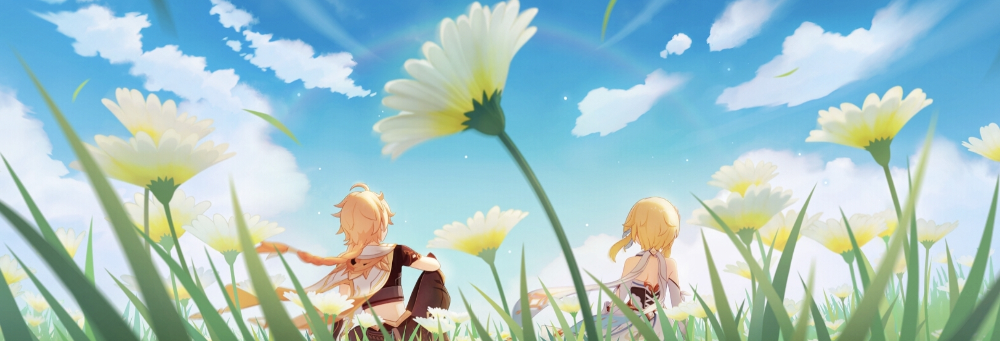

   
    
  

  

    <code>🌱 Born 2008-05-02</code>
    <code>📍 In Hunan / China.</code>
  

- <strong> As someone who is still learning, I'd love to hear your thoughts. If you know a better solution, feel free to reach out to me via email.

### Link

